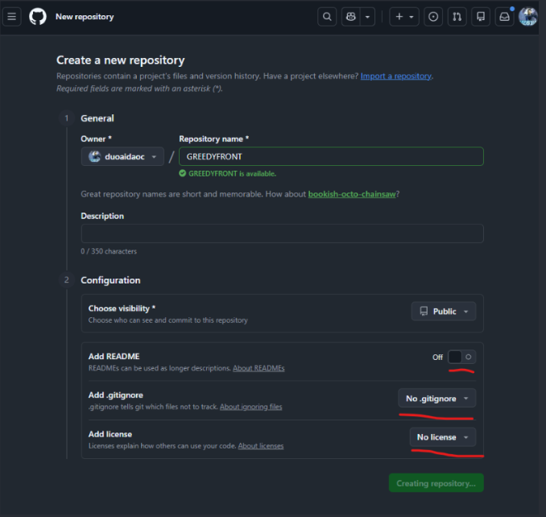
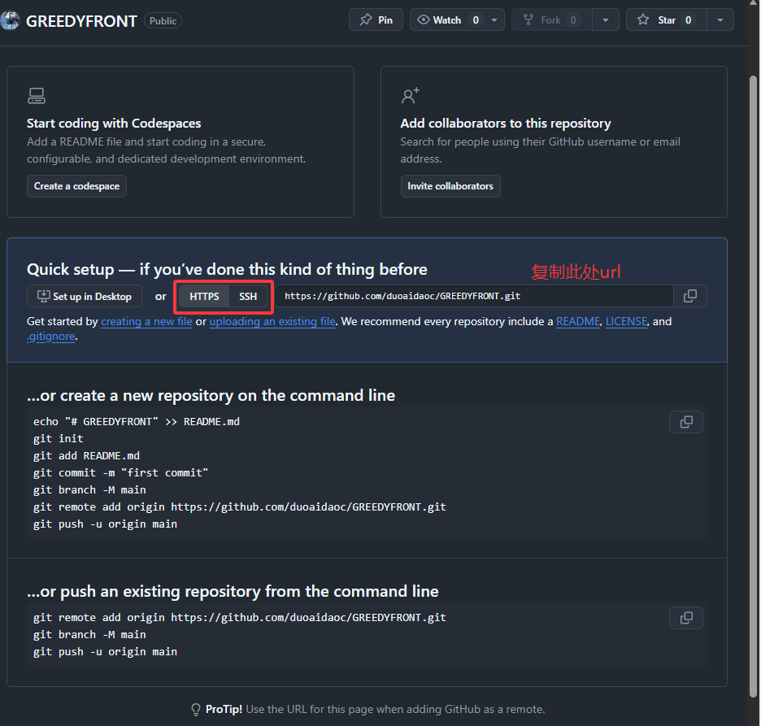

# 1. 在本地安装git

确认是否本地安装了git

```bash
git --version
```

    ·[Git](https://git-scm.com/) 首页

# 2. 项目根目录下建立本地仓库

```bash
git init
```

# 3. 在github上新建远程仓库

（ps：图片使用qq截图即可）




# 4. 关联本地和远端

上述操作完成后将自动跳转到快速启动页面



在你的终端中，运行下面的命令，将 `<your-remote-repo-url>` 替换为你刚刚复制的 URL。[使用https简单些，也可用ssh，需要事先在主机上绑定]

```bash
git remote add origin <your-remote-repo-url>
```
