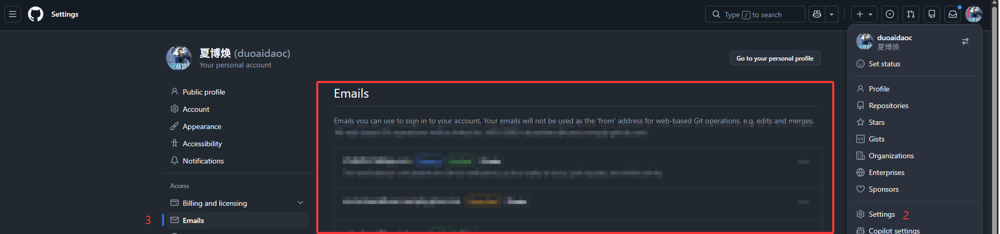

# 1. 在本地安装git

确认是否本地安装了git

```bash
git --version
```

    ·[Git](https://git-scm.com/) 首页

# 2. 项目根目录下建立本地仓库

```bash
git init
```

# 3. 在github上新建远程仓库

（ps：图片使用qq截图即可）


# 4. 关联本地和远端

上述操作完成后将自动跳转到快速启动页面


在你的终端中，运行下面的命令，将 `<your-remote-repo-url>` 替换为你刚刚复制的 URL。[使用https简单些，也可用ssh，需要事先在主机上绑定]

```bash
git remote add origin <your-remote-repo-url>
```

这条命令将远程仓库命名为 `origin`（这是惯例）。

# 5. 推送到远程仓库

## 问题1：作者身份未配置

```bash
git add .
>>> ext time Git touches it

git commit -m "init push"
>>> Author identity unknown......
```

提示作者身份未配置。(若已配置可略过此部分)

推荐使用全局配置

```bash
# 配置全局提交邮箱（替换为你的常用邮箱/代码平台注册邮箱）
git config --global user.email "your_email@example.com"

# 配置全局提交用户名（替换为你的昵称/代码平台账号名）
git config --global user.name "夏博焕"

# 验证全局配置是否生效
git config --global --list
```

email在这里看



用户名在这里看


现在再次commit

```bash
git commit -m "init push"
>>> [main (root-commit) 4e93af4] init push
>>> 42 files changed, 1222 insertions(+) ......
```

## 问题2： 远端未配置上传分支

```bash
git push
>>> fatal: The current branch main has no upstream branch.
>>> ......
```

**原因**：没有将本地的分支与远程仓库的分支进行关联

```bash
git branch
>>> main
```

通过 `git branch`查看本地分支只有 `main`

```bash
# push时指定分支
git push --set-upstream origin main
```
